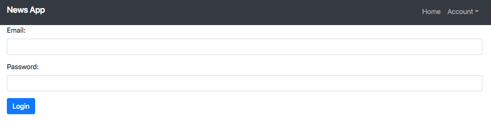

# News Search App

> a news search app to get top news and search for interested topics, the user can also save news once log in.
[Link](https://shielded-scrubland-17146.herokuapp.com/)

## Quick Start

``` bash
# Install dependencies for server
npm install

# Install dependencies for client
npm run client-install

# Run the client & server with concurrently
npm run dev

# Run the Express server only
npm run server

# Run the React client only
npm run client

# Server runs on http://localhost:5000 and client on http://localhost:3000
```
## App Info




## Built With

* [React](https://facebook.github.io/react/)
* [Express](https://expressjs.com/)
* [Bootstrap](https://getbootstrap.com/)
* [News API](https://newsapi.org/)

### Author

Bryan Wang

### Version

1.0.0

### License

This project is licensed under the MIT License